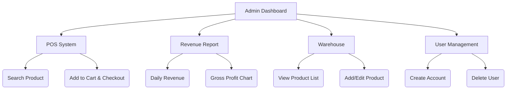

```mermaid
graph TD
    Dashboard[Admin Dashboard] --> POS[POS System]
    Dashboard --> Report[Revenue Report]
    Dashboard --> Warehouse[Warehouse]
    Dashboard --> User[User Management]

    POS --> POS1(Search Product)
    POS --> POS2(Add to Cart & Checkout)

    Report --> Rep1(Daily Revenue)
    Report --> Rep2(Gross Profit Chart)

    Warehouse --> Ware1(View Product List)
    Warehouse --> Ware2(Add/Edit Product)

    User --> User1(Create Account)
    User --> User2(Delete User)
```
