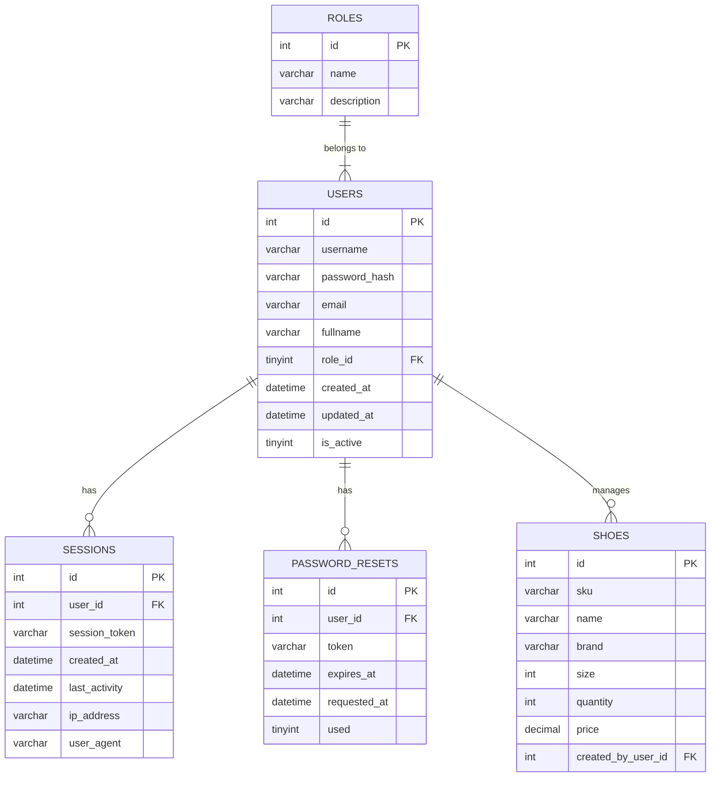

```mermaid
erDiagram
    %% Bảng ROLES
    ROLES {
        int id PK
        varchar name
        varchar description
    }
    
    %% Bảng USERS
    USERS {
        int id PK
        varchar username
        varchar password_hash
        varchar email
        varchar fullname
        tinyint role_id FK
        datetime created_at
        datetime updated_at
        tinyint is_active
    }
    
    %% Bảng SESSIONS
    SESSIONS {
        int id PK
        int user_id FK
        varchar session_token
        datetime created_at
        datetime last_activity
        varchar ip_address
        varchar user_agent
    }
    
    %% Bảng PASSWORD_RESETS
    PASSWORD_RESETS {
        int id PK
        int user_id FK
        varchar token
        datetime expires_at
        datetime requested_at
        tinyint used
    }
    
    %% Bảng SHOES (Của dự án bạn)
    SHOES {
        int id PK
        varchar sku
        varchar name
        varchar brand
        int size
        int quantity
        decimal price
        int created_by_user_id FK
    }

    %% Quan hệ
    ROLES ||--|{ USERS : "belongs to"
    USERS ||--o{ SESSIONS : "has"
    USERS ||--o{ PASSWORD_RESETS : "has"
    USERS ||--o{ SHOES : "manages"
```
